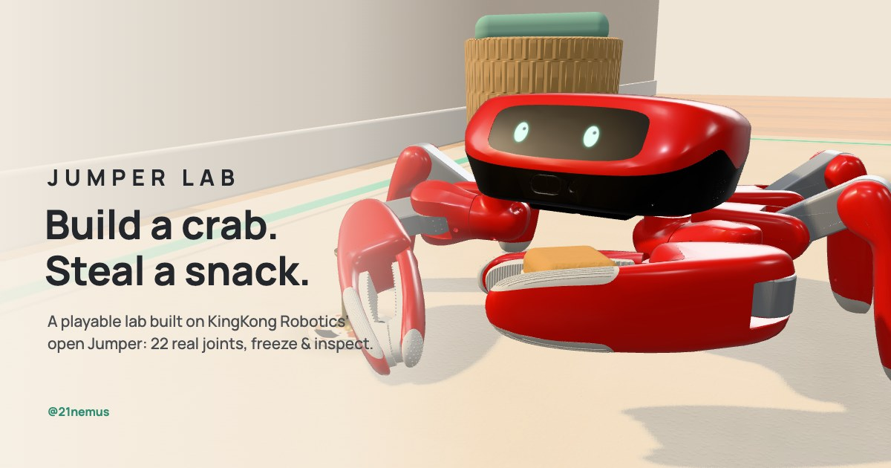

# JUMPER LAB

**Build a crab. Steal a snack.** A playable robotics lab based on KingKong Robotics' open
[Jumper](https://github.com/KingKongRobotics/jumper), the 22-servo crab robot.



- **Play:** walk Jumper through a sunlit room corner, grab an oat cube from its stand with the robot's real claw, and drop it in the mint dish.
- **Inspect:** freeze at any moment and look inside the limb in use: its joint axes, live angles and limits, and how it works, with the upstream source.
- **Build:** optionally assemble the robot from its own parts, module by module, then watch it stand up into its calibrated pose.
- **Watch:** a one-minute guided tour (▶ Watch, or `T`) that plays all three through the real controls, made for screen recording.
- **Crab rave:** Jumper raises both claws and dances on the beat of an original soundtrack while a crowd of Jumpers scuttles in to join it (`C`, or Gestures in the menu).

The robot is KingKong's published model at a pinned commit: every link mesh, joint axis, joint limit, the
calibrated standing pose, the claw's measured opening and four recorded gestures. The walking is a labelled
**kinematic game controller** on those real joints, not a physics simulation and not KingKong's trained
policies. See [SOURCES.md](SOURCES.md) for exactly what is real and what is approximated.

This is an independent project. It is not an official KingKong product, not a validated digital twin, not an
assembly manual and not a robot controller.

## Run it

Node 22.12 or newer.

```bash
npm install
npm run dev        # http://127.0.0.1:5176
```

Other scripts:

```bash
npm test           # 55 Node tests (assets, kinematics, IK, gait, claw reach, mission, gestures, crab rave, music)
npm run build      # type-check + static build into dist/
npm run preview    # serve dist/ on http://127.0.0.1:5177
```

| URL parameter | Effect |
|---|---|
| `?tour` | Starts the ~58 s guided tour on load (the same as ▶ Watch). |
| `?capture` | The same tour, with its stop button never shown, for screen recording. |
| `?rig` | The asset import check: every joint on a slider, upstream's poses, six fixed views. |
| `#shell=mint&trial=1` | A shared setup: shell colour and time-trial mode. It is not a score or a replay. |

### Rebuilding the robot assets

The generated files in `public/assets/` are committed. To regenerate them from the pinned upstream commit:

```bash
npm run upstream:fetch   # downloads 61 pinned files (22 MB) into tools/.cache/, verified against tools/upstream.lock.json
npm run assets           # build-robot + build-motions, then `npm run dance` (rave.json, scuttle.json) and `npm run crowd` (jumper-crowd.glb)
npm test
```

To move to a newer upstream commit:

1. Edit `commit` in `tools/upstream.config.json`.
2. Run `npm run upstream:lock`, then the two commands above.

The build scripts stop if upstream's numbers disagree with each other (for example `HOME` in `constants.py` against
the policy contract).

## Controls

| | Keyboard | Touch | Gamepad |
|---|---|---|---|
| Walk / crab-step | `W` `S` / `A` `D` (or arrows) | joystick | left stick |
| Turn | `Q` `E` (or `←` `→`, `J` `L`) | ⟲ ⟳ buttons | right stick |
| Claw: grab or drop | `Space` / `Enter` | Grab / Drop button | A |
| Freeze and inspect | `F` / `I` | ❄ button | Y |
| Wave (recorded gesture) | `H` | menu | — |
| Reset | `R` | ⏮ button | View / Back |
| Build mode | `B` | Build tab | — |
| Back to play | `P`, `Esc` | Play tab | — |
| Watch the guided tour | `T` (`Esc` or `T` stops it) | ▶ Watch | — |
| Crab rave | `C` | menu → Gestures | — |
| Music on or off | `M` | ♪ button | — |

- **Grab:** walk until the snack is about 20–25 cm in front of the left or the right claw. The ring under the stand turns mint when a claw can reach it, and the camera looks down over the robot as you get close, so the target stays in view.
- **Drop:** press the claw button when the snack is over the dish and the claw lets go right there. If the dish is near but not underneath, the claw reaches over it. When it can't, a hint says why: get closer, turn to face it, back up, or turn so the dish is on the side of the claw holding the snack.
- **Crab rave:** from standing still with empty claws, or "Celebrate: crab rave" after a delivery. It needs open floor around Jumper for a big crowd (the middle of the rug is best). Moving or pressing the claw button ends it.
- **Music:** original, synthesized live in the browser, and only during the tour and the crab rave. It never plays on page load, fades in over 3 s to 75 % of a quiet level, and goes through a limiter. The ♪ button and the menu's volume slider are remembered on this device.
- **Freeze:** drag to orbit the limb, scroll to zoom, and pick another limb or view in the panel.
- **Calm or time trial:** choose in the menu (≡). Best times stay on this device.

### Recording a video

1. Size the browser window to the format you want, for example 1920 × 1080 or 1280 × 720 for 16:9.
2. Start your screen recorder, then press ▶ Watch (or `T`).
3. Everything but the captions and the live Build and Inspect panels hides. The pointer and the stop button hide after 1.6 s without mouse movement.
4. The tour runs about a minute (61.6 s measured): the recorded wave, Build with a claw-joint test, the walk, the grab, a freeze through four Inspect views, the depth view, the drop, and a crab-rave finale under the end card.
5. The soundtrack plays during the tour. To have it in the video, your screen recorder has to capture the computer's sound (system audio), not just the microphone. Not every built-in recorder can; OBS Studio can.

Stretches that run faster than real time show a small "2× speed" style badge under the caption. `Esc` or `T` stops the tour. `?capture` starts it on load with the stop button never shown.

## How it works

- `tools/`: pinned upstream fetch and verification, plus the Node-only asset pipeline (MJCF + STL → glTF + JSON). No Python, MuJoCo or Git LFS is needed.
- `src/sim/`: the whole game simulation in plain TypeScript, so it runs in the browser and in Node tests. It is a fixed 120 Hz step and one cloneable state:
  - limb chains and a damped-least-squares IK that never leaves the joint limits;
  - the gait planner, with planted feet fixed in the world and footholds planned for mid-stance;
  - the claw: a closed-form planar reach in upstream's arm-out roll that searches the jaw heading and both elbow branches, keeping only poses that clear the robot's own body (footprints measured from the meshes);
  - the snack, the mission, gesture playback, and an autopilot that the tour and tests drive;
  - the crab rave: the choreography generated from the model on the music's beat (`dance.ts`), and the crowd's plan (`rave.ts`: a camera spot clear of furniture, rows of dance spots, sideways entrances timed so nobody walks through anybody).
- `src/robot/`: the robot model, forward kinematics, the GLB loader, the normals worker, the rig and the eyes.
- `src/audio/`: the original score and its Web Audio synthesizer (oscillators and noise, no samples), with the song clock the dance follows.
- `src/scene/crowd.ts`: the crowd, as one instanced mesh per link of a low-poly Jumper (20 dancers cost about one full-detail robot), and the party lights.
- `src/inspect/`, `src/build/`, `src/tour/`, `src/ui/`, `src/scene/`: the three modes, the menu, the room and the camera.

### Quality bars

These are measured, and the tests enforce them:

- **Standing pose:** feet within 0.01 mm of the floor at `HOME` on the source meshes, 0.3 mm on the shipped ones.
- **Footprint:** foot sites equal upstream's measured stance to 0.000 mm.
- **Walking:** over a 40 s random walk, planted feet move less than 1 mm (no skating), IK error stays under 1 mm, and joints stay in their limits.
- **Grasp:** the claw attaches the snack only when its closed jaws are on it (0.1 mm in the reference run).
- **Crab rave balance:** with both claws up Jumper stands on its four walking legs. At `HOME` its centre of mass is 17 mm in front of those feet, so the dance first steps the middle feet 45 mm forward. Over the whole routine the centre of mass stays at least 21.6 mm inside the feet that are down, every joint stays inside its limits, and planted feet drift at most 0.11 mm.
- **Music level:** measured offline at the default 75 %, the busiest section averages −20.7 dBFS with peaks at −3.3 dBFS and no clipping (about 6 dB under typical streaming loudness); the intro averages −27 dBFS.
- **Reach:** the closed-form arm reproduces 4,000 random arm poses to 1e-16 m. Grabbing works from 542 cm² of snack positions and dropping from 694 cm² of dish positions; the old window allowed 324 and 396. A dish right under the carried snack drops in place, and 921 planned claw poses are checked against the meshes for self-collision.
- **Freeze:** resume restores the exact simulation state.

Step heights are small (about 1–2.5 cm): at the calibrated standing pose the knees and wrists are close to their stops, so the robot has little room to fold further. That is a property of the model, not a tuning choice.

## Testing and coverage, honestly

- **Automated:** 55 Node tests, including two full scripted missions (the reference route and the tour's), the claw's reach and self-collision, the crab rave's balance and limits, the crowd plan (no collisions, in place before the drop), the score, freeze/resume equality and rapid button presses.
- **Not automated:** the music itself. Its loudness and tone were measured by rendering it offline in the browser, and it was not listened to during development.
- **Browser:** tested in Claude Code's in-app Chromium only, at:
  - desktop 1280 × 800;
  - 390 × 844 portrait, with touch emulation;
  - 740 × 360 landscape, with touch emulation;
  - an 844 × 390 desktop window;
  - 1280 × 720 (16:9) for the guided tour, stepped frame by frame.
- **Not tested** on real phones, Safari or Firefox.
- **Performance** (on the development Mac, Apple Silicon):
  - about 1.9 ms per frame for simulation and rendering at 1024 × 768;
  - about 158 draw calls and 340k triangles including the shadow pass;
  - normals rebuild in about 120 ms in a worker.
  - Phone frame rates have not been measured. Resolution adapts automatically when frames run slow.

## Deploy

`dist/` is a static site with relative paths, so it works from any sub-path, for example a GitHub Pages
project site.

- **Live site:** [21nemus.github.io/jumper-lab](https://21nemus.github.io/jumper-lab/). The preview-card tags in `index.html` use absolute URLs on that address (X only shows a large card with an absolute image URL); change them if the site moves.
- **GitHub Pages:** `.github/workflows/pages.yml` tests, builds and deploys `dist/` on every push to `main`. In the repository, set Settings → Pages → Source to "GitHub Actions".
- **Repository:** [github.com/21nemus/jumper-lab](https://github.com/21nemus/jumper-lab).

## Credits and licenses

- **Robot:** Jumper robot model, poses and gestures by [KingKong Robotics](https://github.com/KingKongRobotics/jumper), Apache-2.0. Derived files and changes are listed in [ASSETS.md](ASSETS.md) and [public/assets/robot/NOTICE.md](public/assets/robot/NOTICE.md).
- **Libraries:** [three.js](https://threejs.org/) (MIT) and Manrope (SIL OFL 1.1). License texts are in `public/licenses/`.
- **Music and the crab-rave choreography:** original to this project (MIT). The soundtrack is not "Crab Rave" by Noisestorm (Monstercat) and quotes none of it.
- **Original code and content:** MIT, see [LICENSE](LICENSE). Made by [@21nemus](https://x.com/21nemus). Also by the same author: [Inside the Vibe A1](https://21nemus.github.io/vibe-a1-explainer/).
